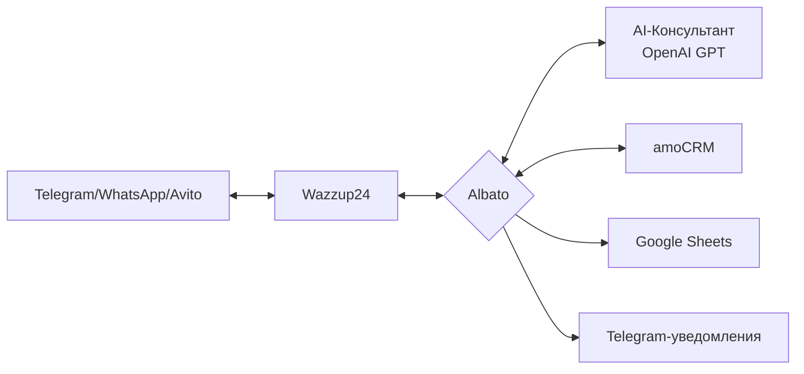

# 🤖 AI-Консультант для жилых комплексов: автоматизация продаж с интеллектом

**Умный ассистент для девелоперов**  
*Интеграция Telegram, CRM и аналитики в едином решении*

---

### 🚀 Что делает система:
- **Автоматизирует 90% рутинных запросов** через Telegram/WhatsApp/Avito  
- **Консультирует клиентов** по ЖК "СияниеЕли" на базе GPT  
- **Собирает данные** (контакты, интересы, бюджет) → передает в CRM  
- **Создает сделки в amoCRM** и синхронизирует с Google-таблицами  
- **Триггерит задачи менеджерам** при готовности клиента к сделке

---

### 💡 Ключевые преимущества:
| **Для клиентов**          | **Для бизнеса**               |
|---------------------------|-------------------------------|
| ▶️ Круглосуточная поддержка | ▶️ Сокращение нагрузки на менеджеров |
| ▶️ Мгновенные ответы       | ▶️ Автоматическая воронка продаж |
| ▶️ Запись на созвон в 1 клик | ▶️ Аналитика в реальном времени |

---

### ⚙️ Технологический стек:

---

### 🔥 Почему это эффективно:
- **Гибкая интеграция** с любыми CRM (не только amoCRM)  
- **Кастомизация сценариев** под специфику ЖК  
- **База знаний** с актуальной информацией о проекте  
- **Фильтрация спама** и триггерных фраз  
- **Масштабирование** на 1000+ диалогов ежедневно  

---

### 📊 Результат внедрения:  
- Сокращение времени обработки лидов на **70%**  
- Рост конверсии в сделку на **40%**  
